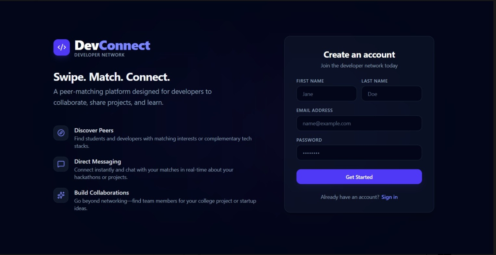
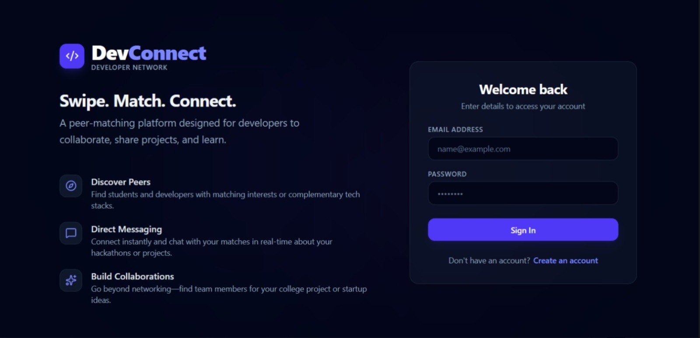
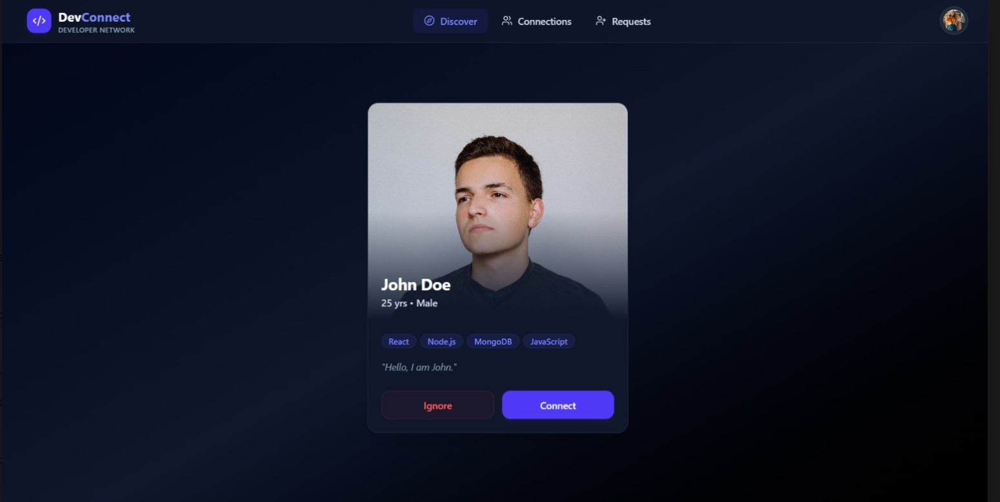
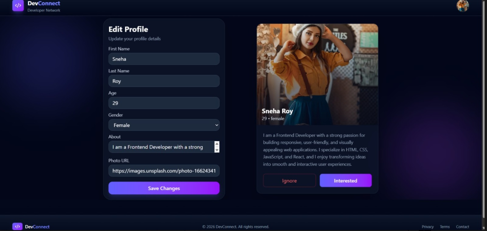
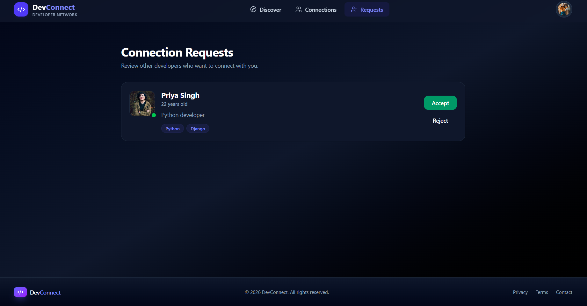
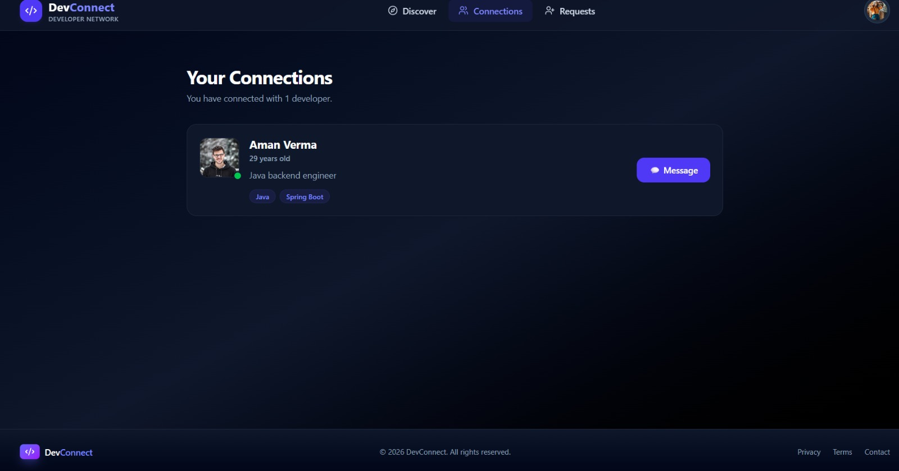

# 🚀 DevConnect

> A full-stack developer networking and real-time chat platform built using MERN stack + Socket.IO. It allows developers to discover profiles, connect, and chat instantly in real time.


# 📸 Screenshots

## 📝 User Registration

Create a new developer account to join the DevConnect platform.



---

## 🔐 Secure User Login

Authenticate securely and access your developer dashboard.



---

## 🔍 Discover Developers

Browse developer profiles, explore skills, and send connection requests.



---

## 👤 Edit Profile & Live Preview

Update your personal information, profile picture, bio, and instantly preview profile changes.



---

## 📨 Connection Requests Management

Review incoming connection requests, inspect developer profiles, and accept or reject requests.



---

## 🤝 My Connections

View all your accepted developer connections.



---

## 🔥 Features

- 🔐 JWT Authentication (signup/login/logout with httpOnly cookies)
- 👤 Developer profiles (skills, bio, photo, age, gender) with live preview
- 🧭 Developer feed with pagination, send/ignore requests, no duplicates
- 🤝 Connection system (accept/reject requests, view connections)
- 💬 Real-time chat using Socket.IO with private rooms (SHA-256 based)
- 🗄 Persistent chat storage in MongoDB
- 🎨 Dark UI with Tailwind CSS + responsive design
- ⚡ Redux Toolkit for state management
- 🔔 Toast notifications + loaders for better UX

---

## 🛠 Tech Stack

**Backend:**
Node.js, Express, MongoDB, Mongoose, Socket.IO, JWT, bcrypt, cookie-parser, CORS

**Frontend:**
React, Vite, Redux Toolkit, Tailwind CSS, Axios, React Router, Socket.IO Client

---

## 🏗 Architecture

Frontend (React + Redux)
        ↓ REST API (Axios)
Backend (Express + JWT Auth)
        ↓
MongoDB (Users, Requests, Chats)

Real-Time:
React ↔ Socket.IO ↔ Node Server

---

## 📡 API Endpoints

**Auth**
- POST /api/auth/signup
- POST /api/auth/login
- POST /api/auth/logout

**Profile**
- GET /api/profile/view
- PATCH /api/profile/edit

**Requests**
- POST /api/request/send/:status/:toUserId
- POST /api/request/review/:status/:requestId

**Network**
- GET /api/user/feed
- GET /api/user/requests/received
- GET /api/user/connections

**Chat**
- GET /api/chat/:targetUserId

---

## 🔐 Security

- JWT stored in httpOnly cookies
- Password hashing using bcrypt
- Protected routes using middleware
- No duplicate/self connection requests
- Secure chat rooms using SHA-256 hashing

---

## 📁 Project Structure

```text
DevConnect/
├── backend/
│   ├── index.js
│   ├── .env
│   ├── package.json
│   └── src/
│       ├── config/
│       │   ├── db.js
│       │   └── socket.js
│       ├── controllers/
│       │   ├── auth.controller.js
│       │   ├── profile.controller.js
│       │   ├── request.controller.js
│       │   └── user.view.controller.js
│       ├── middlewares/
│       │   └── auth.middleware.js
│       ├── models/
│       │   ├── user.model.js
│       │   ├── connectionRequest.model.js
│       │   └── chat.js
│       └── routes/
│           ├── auth.route.js
│           ├── profile.route.js
│           ├── connectionRequest.routes.js
│           ├── network.routes.js
│           └── chat.route.js
│
└── frontend/
    ├── index.html
    ├── vite.config.js
    ├── package.json
    └── src/
        ├── App.jsx
        ├── main.jsx
        ├── Components/
        │   ├── Auth.jsx
        │   ├── Body.jsx
        │   ├── Navbar.jsx
        │   ├── Footer.jsx
        │   ├── Feed.jsx
        │   ├── UserCard.jsx
        │   ├── EditProfile.jsx
        │   ├── Profile.jsx
        │   ├── Connection.jsx
        │   ├── Request.jsx
        │   └── Chat.jsx
        └── utils/
            ├── appStore.js
            ├── userSlice.js
            ├── feedSlice.js
            ├── connectionSlice.js
            ├── requestSlice.js
            ├── socket.js
            └── constant.js
```

## 🚀 Summary

DevConnect is a full-stack MERN project that combines:
- REST APIs for core backend logic
- Socket.IO for real-time chat
- JWT authentication for security
- Modern responsive frontend UI

It demonstrates full-stack development, authentication flow, real-time systems, and scalable architecture.